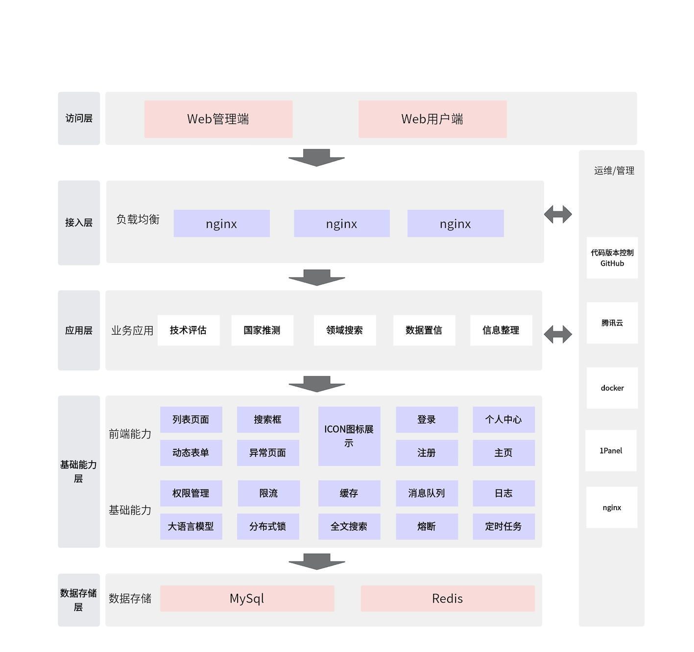
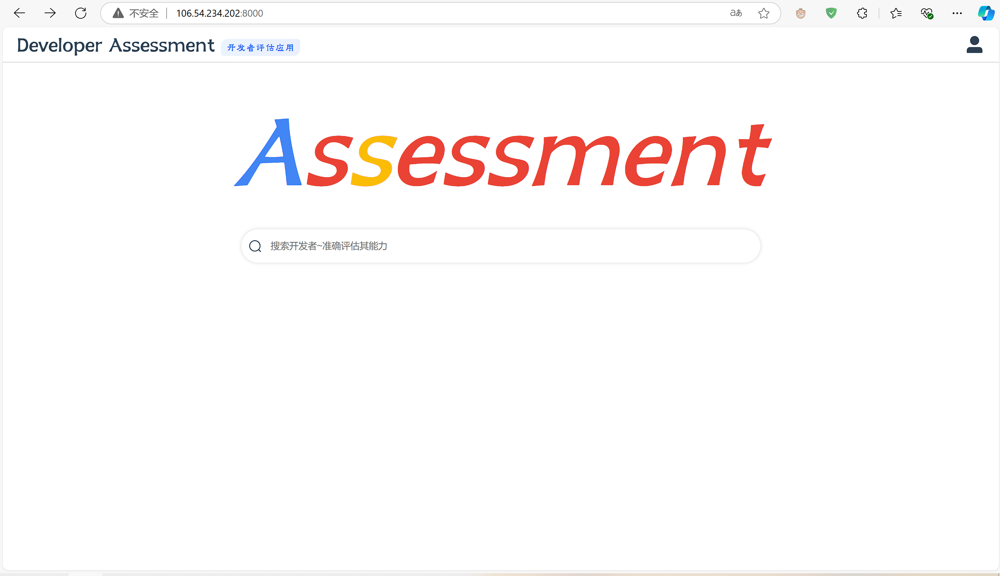
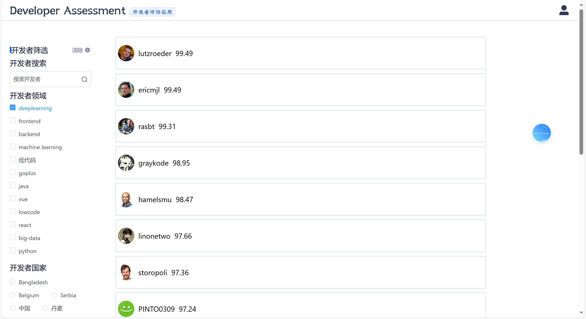
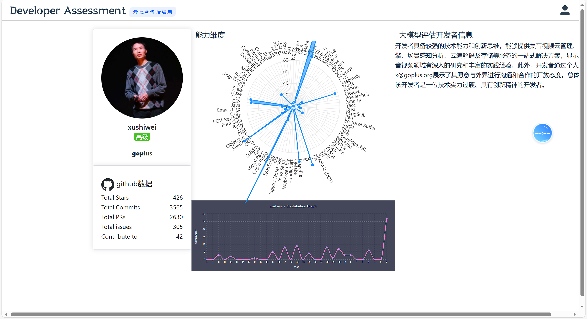
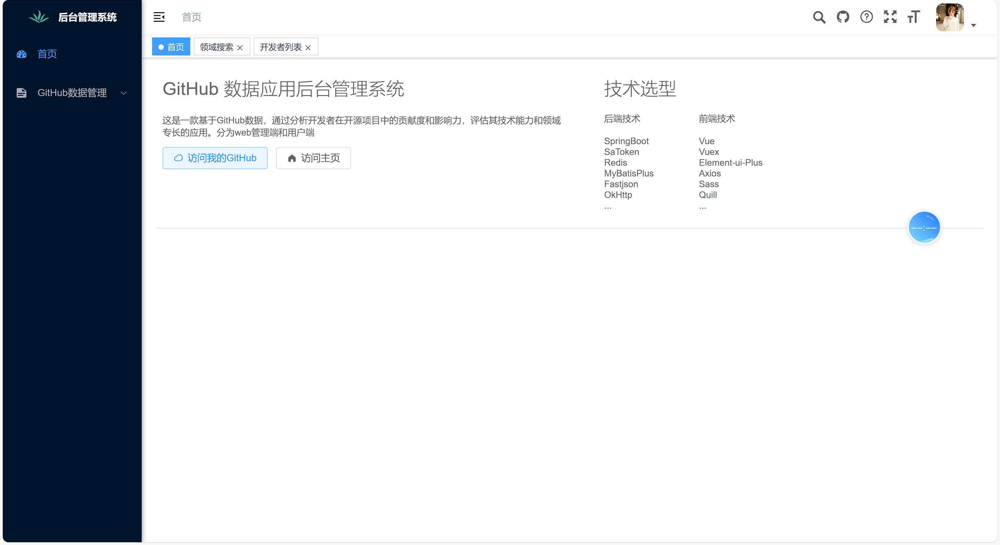
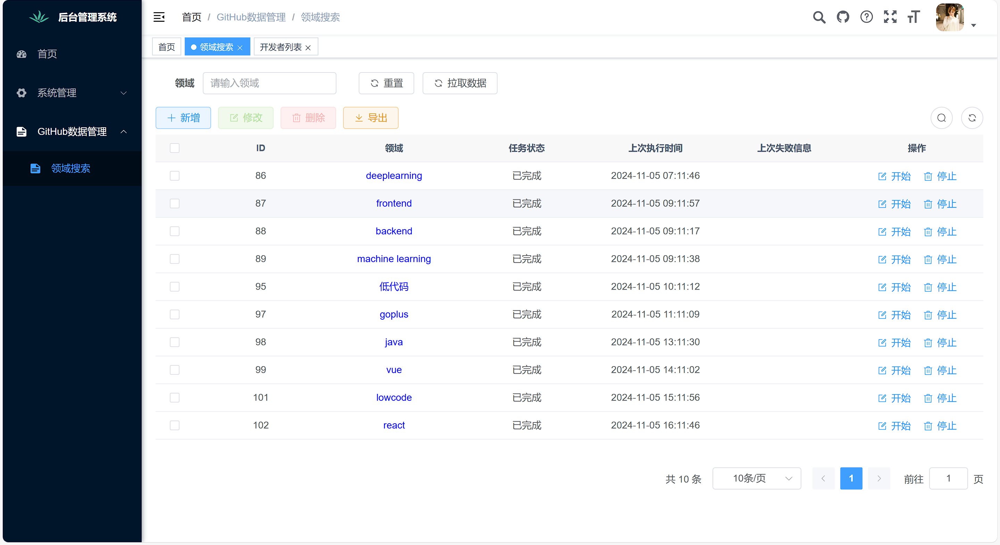
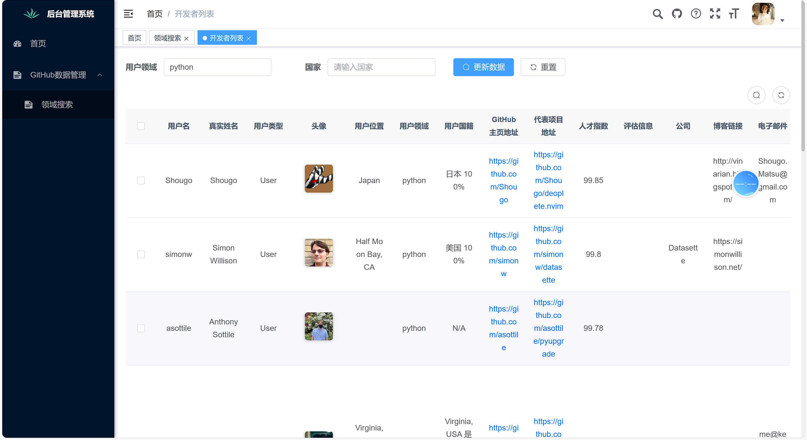

- 飞书文档：https://ivyy4v6cfd7.feishu.cn/wiki/KP2sw6pDOivrQPksUgrc9ZeNnOg?from=from_copylink
- 演示视频：https://ivyy4v6cfd7.feishu.cn/wiki/KP2sw6pDOivrQPksUgrc9ZeNnOg#share-PgYjdzG3xorj5exgoimcum7DnLb
- 用户端地址:http://106.54.234.202:8000
- 管理端地址:http://106.54.234.202:8200 账号：test 密码： 123456
- 项目地址：https://github.com/GatsbyH/qiniu-collector
- 管理端前端项目地址：https://github.com/GatsbyH/qiniu-collector-ui

